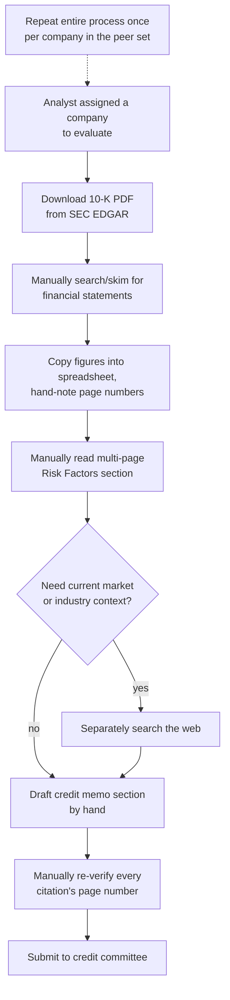
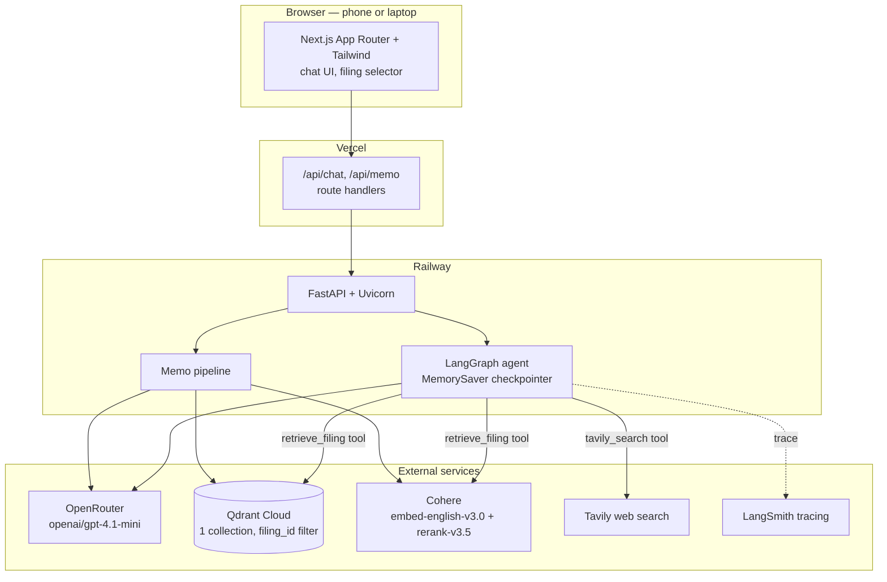
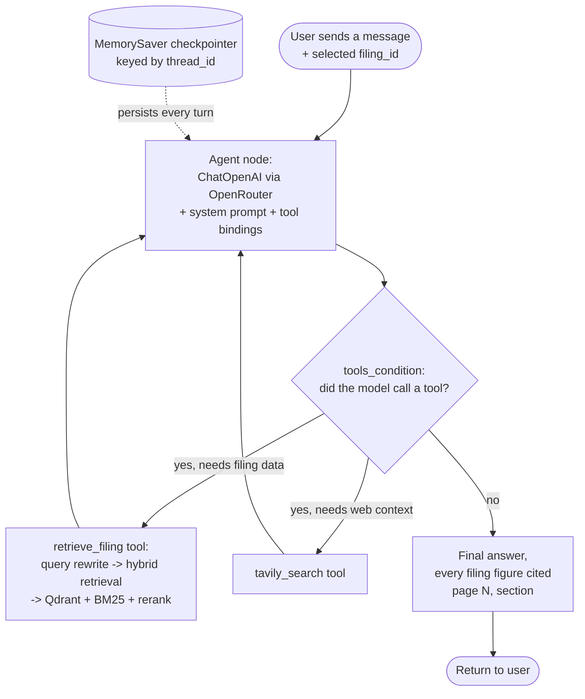

# CreditLens

**An agentic RAG assistant for commercial credit analysts**

- Live app: https://credit-lens-teal.vercel.app
- Backend: https://credit-lens-production-929c.up.railway.app
- Repo: https://github.com/adapaania/credit-lens

---

## The problem

Commercial credit analysts spend hours manually reading hundred-plus-page SEC 10-K filings to find, cross-check, and cite the exact financial figures and risk disclosures a credit memo requires. It's slow, it's error-prone, and it's hard to audit after the fact.

## Who this is for

The intended user is a commercial credit analyst — someone at a bank, a corporate lending desk, or an internal risk team, assessing a company's creditworthiness to support a lending decision, a credit line renewal, or an internal risk rating. Their core deliverable is a credit memo: a written assessment that states specific figures (revenue, net income, total debt, cash, liquidity ratios) and specific risks (litigation, regulatory exposure, industry headwinds), each one expected to be traceable back to the exact page of the filing it came from. Credit committees and auditors will always ask "where did this number come from?", so that traceability isn't optional.

Today, that traceability is entirely manual. An analyst assigned to evaluate Boeing's credit profile downloads the 10-K PDF from SEC EDGAR (over 150 pages), then works through it largely by `Ctrl-F` and skimming: locating the consolidated income statement, balance sheet, and cash flow statement; copying figures like revenue, net income, total debt, cash, current assets, and current liabilities into a spreadsheet or memo template; and hand-noting the page number next to each figure so it can be verified later. To assess a company-specific credit risk — for Boeing, the 737 MAX production and FAA-scrutiny fallout — they read the multi-page "Risk Factors" section by hand, and often separately search the web to check whether an older disclosed risk is still current. When comparing a peer set — Boeing vs. Lockheed Martin vs. RTX, as in this build — the entire process repeats once per company, with the analyst cross-referencing spreadsheets side by side. Drafting the memo's "Financial Summary & Risk Factors" section is then manual synthesis: re-reading notes, writing prose, and re-checking every citation's page number by hand before submission. This can take several hours per filing, and every step where a figure is copied by hand is a place a citation can silently drift from its source.

Here's what that looks like today, with no AI in the loop:

## Scope of this build

Three FY2024 10-K filings — Boeing, Lockheed Martin, and RTX. This aerospace/defense peer set was chosen deliberately: Boeing's 737 MAX aftermath gives a clean, demonstrable link between operational/regulatory risk and credit risk, which made it a good test of whether the app could surface risk narrative as well as hard numbers. On top of that, one chat-style Q&A interface with source citations, one memo-drafting feature, and one evaluation harness that proves the app's financial figures actually match the filings, rather than just trusting the model's word for it.

27 questions were hand-written across the three filings, rather than reaching for an off-the-shelf question set — 20 numeric (each backed by a hand-verified truth value), 4 qualitative (asking about disclosed risks), and 3 refusal probes (a company-specific question paired with a *different* company's filing selected, to check the agent declines rather than answering from general knowledge). Two of the numeric questions are deliberately ambiguous phrasings, designed to probe two failure modes discovered during development: consolidated-vs-segment revenue, and net-loss-vs-net-loss-attributable-to-shareholders. A sample:

| Question | Type |
|---|---|
| What was Boeing's total consolidated revenue in fiscal year 2024? | numeric |
| What was Boeing's total debt at the end of fiscal year 2024? | numeric |
| What were RTX's total current assets at the end of fiscal year 2024? | numeric |
| What liquidity risks did Boeing disclose? | qualitative |
| What does Boeing disclose about production disruptions related to the 737 MAX and FAA scrutiny? | qualitative |
| What are Lockheed Martin's main risks related to its reliance on U.S. government contracts? | qualitative |
| What was Boeing's total revenue? *(ambiguous phrasing — probes consolidated-vs-segment confusion)* | numeric |
| What was Boeing's net loss? *(ambiguous phrasing — probes net-loss-vs-attributable confusion)* | numeric |
| What was Lockheed Martin's total net sales in fiscal year 2024? *(asked with Boeing's filing selected)* | refusal |

The ambiguity probes and refusal questions were additionally verified directly against the live production agent, not just the simplified eval-only pipeline, since both are really testing agent-level behavior — query handling, filing-scope enforcement — more than pure retrieval quality.

---

## The solution

In one sentence: CreditLens is an agentic RAG application that lets a credit analyst select a SEC 10-K, ask natural-language questions or request a drafted memo section, and get back answers where every financial figure is grounded in and cited to an exact page and section of the filing — with an agent that can also pull in current market context from the web when a question calls for it, without ever presenting web data as if it were a filing figure.

In practice: a credit analyst opens the app, picks a filing from a dropdown, and asks questions the way they'd ask a colleague — "what's Boeing's total debt?", "what liquidity risks did they disclose?", "how does that compare to Lockheed?" — in a normal chat thread that remembers earlier turns. Every financial figure in the response carries a `(page N, section)` citation traceable to the source PDF, and a "Draft memo section" button turns the same retrieval pipeline into a structured, cited Financial Summary & Risk Factors write-up. If a question needs context outside the filing — current market conditions, say — the agent decides on its own to search the web instead of guessing, and keeps that answer clearly separated from anything sourced to the SEC filing.

### How the pieces fit together

| Component | Choice | Why |
|---|---|---|
| Frontend | Next.js App Router + Tailwind, on Vercel | Responsive out of the box, so the app works on phone and laptop browsers without a separate mobile build |
| Backend | FastAPI + Uvicorn, on Railway | A lightweight Python service that matches the LangGraph/LangChain ecosystem natively, rather than bridging from another language |
| LLM gateway | OpenRouter, `openai/gpt-4.1-mini` | Every LLM call goes through one gateway instead of a raw OpenAI SDK call, so the underlying model is swappable without touching app code |
| Agent orchestration | LangGraph `StateGraph` + `MemorySaver` checkpointer | Gives the agent per-thread conversational memory and explicit tool-routing instead of hand-rolling a loop |
| Embeddings | Cohere `embed-english-v3.0` | OpenRouter doesn't expose an embeddings endpoint, so this is isolated in one swappable module rather than baked into the retrieval code |
| Vector store | Qdrant Cloud, one collection filtered by `filing_id` | Keeps all filings in a single collection instead of provisioning one per filing |
| Reranker | Cohere Rerank `rerank-v3.5` | Used in the hybrid retrieval pipeline to cut a fused candidate set down to the most relevant chunks |
| Lexical retrieval | BM25 (`rank_bm25`) | Combined with dense retrieval via reciprocal rank fusion — catches exact-term matches, like an exact line-item label, that embeddings alone can miss |
| External search | Tavily | Gives the agent a second, clearly-bounded data source for context that isn't in the filing |
| Observability | LangSmith tracing | Auto-instrumented by LangChain from environment variables, no extra code |
| Evals | Ragas + a custom numeric exact-match harness | Ragas alone can't verify a specific dollar figure is correct, so a harness was built to check that directly |

### How the agent decides what to do

The agent is a two-node LangGraph: an `agent` node that calls the LLM (bound to both tools) and a `tools` node that executes whichever tool the model chose. Routing goes back to `tools` whenever the model's response is a tool call, and to the end once it produces a plain-text answer — so the agent can chain multiple tool calls in one turn (retrieve filing data, then also search the web) before answering. The rule enforced in the system prompt, not just by convention, is that company-specific financial figures must come from filing retrieval, current market or industry context may come from web search, and the two never get blended into a single cited value. A `MemorySaver` checkpointer, keyed by a frontend-generated thread ID, means a follow-up question like "how does that compare to Lockheed?" resolves against the actual prior turns in that thread rather than needing to be self-contained.

---

## The data

### How the filings are chunked

Filings are parsed page-by-page with `pymupdf4llm`, which preserves page numbers — essential, since every figure in the app has to cite one — and then chunked by two rules:

1. **Section-aware.** A chunk boundary is drawn wherever a markdown header line appears. One tuning decision mattered more than expected here: bold *and* italic lines are risk-factor emphasis style in this SEC corpus, not real section headers — treating them as headers was an early bug that mis-attributed 27 chunks across 8 pages to the wrong header. Real structural headers in this corpus are bold-only, so bold+italic lines are now explicitly excluded from header detection.
2. **Table-safe.** A markdown table block is never split mid-table. A 10-K's financial statements are tables where a line-item label and its value live in the same row — splitting a table arbitrarily by character count could separate "Total debt" from "$53,864" onto two different chunks, silently breaking the citation.

Non-table chunks are capped at 1,500 characters to keep embeddings focused; table chunks stay atomic regardless of size, on the theory that a broken table is worse than an oversized one. There was a secondary consequence of this found only later: a short, terse table row like "Total current assets 127,998" doesn't stand out lexically or semantically against filler words in a full natural-language question, even though the row itself is chunked and indexed correctly. That turned out to be a retrieval problem, not a chunking one — more on that below.

### Where the data comes from, and how the two sources interact

The first source is a curated SEC filing corpus — three FY2024 10-Ks, sourced directly from SEC EDGAR by accession number rather than a third-party mirror:

| Company | Accession Number | Filed |
|---|---|---|
| Boeing | 0000012927-25-000015 | 2025-02-03 |
| Lockheed Martin | 0000936468-25-000009 | 2025-01-28 |
| RTX | 0000101829-25-000005 | 2025-02-03 |

SEC EDGAR only serves modern 10-Ks as inline-XBRL HTML, not native PDF, so each `.htm` was converted to a paginated PDF with headless Chrome purely to give the parser real page boundaries to cite against — the content itself is untouched, only the container format changed. These three PDFs are ingested into a single Qdrant collection, with each chunk's payload carrying its filing ID, company, fiscal year, section, page, and text.

The second source is the Tavily web search API — the agent's tool for anything outside the filing: current market conditions, industry news, or context that would be stale or entirely absent from a filing dated months earlier.

The two never get merged into one answer without attribution. The agent's system prompt makes filing retrieval mandatory for any company-specific financial figure, and explicitly forbids presenting a Tavily result as if it were a filing-sourced number. If a question genuinely needs both — "how does Boeing's leverage compare to where interest rates are heading," say — the agent calls both tools and attributes each piece of the answer to its actual source, calling out explicitly if the two cover different time periods or could conflict.

---

## Getting it live

The app is deployed and working end to end: FastAPI backend on Railway, Next.js frontend on Vercel, with the two cross-wired via environment variables. A smoke test checks the health endpoint and a real chat round-trip against the deployed backend on every deploy. Filing selection, cited Q&A, thread-memory follow-ups, web-search routing for non-filing questions, a cited memo section, and both eval pipelines producing saved results — all of it works against the live URLs above, not just locally.

---

## Measuring it

### The test set

27 questions, paired with 18 hand-verified numeric truth values — each cross-checked against the actual filing text with its own page and section, independent of whatever the app happens to retrieve.

### How it was measured

Two complementary measurements, run over both retrieval pipelines:

- **A custom numeric exact-match check.** It extracts every number mentioned in the model's answer, normalizes for unit/scale wording ("million"/"billion"/"thousand"), and checks whether any of them falls within 0.5% relative tolerance of the truth value, comparing magnitudes rather than signed values — a stated "net loss of $11,817 million" should match a truth value of -11817 without being penalized for not using a literal minus sign. Ragas alone can't check this; it scores relevance and faithfulness to retrieved context, not whether a specific dollar figure is actually correct.
- **Ragas** — faithfulness, answer relevancy, and context precision, over the same question set.

### Where things started: naive dense retrieval

| Metric | Naive dense (top-8) |
|---|---|
| Numeric accuracy | 33.3% (6/18) |
| Faithfulness | 0.777 |
| Answer relevancy | 0.422 |
| Context precision | 0.250 |

Only one in three numeric questions came back correct. The low context precision (0.250) was the tell — the model wasn't hallucinating so much as it was being handed the wrong context to work with in the first place. Faithfulness stayed relatively high even as accuracy stayed low, because the model was honestly reporting "the excerpts don't contain that figure" when naive retrieval simply hadn't surfaced the right chunk — a faithful non-answer, but still a failure from an analyst's point of view. That pointed squarely at retrieval, not generation, as the place to invest first.

---

## Making it better

### Fix one: hybrid retrieval instead of naive dense

10-K financial statements are dense with exact, short, repeated labels — "Total debt," "Total current assets" — that a lexical signal like BM25 can match precisely, while dense embeddings alone are better at conceptual similarity than at pinpointing one exact line among many similarly-worded ones. Fusing the two, then reranking with a model trained specifically to judge relevance, should recover the cases naive dense retrieval misses without giving up its strengths on the narrative, risk-factor-style questions where semantic similarity already does well.

Naive dense retrieval was replaced with a hybrid pipeline: dense (top-20) and BM25 (top-20) candidates fused with reciprocal rank fusion, then reranked with Cohere Rerank down to a final top-6.

| Metric | Naive dense | Hybrid (dense + BM25 + rerank) | Change |
|---|---|---|---|
| Numeric accuracy | 33.3% (6/18) | 66.7% (12/18) | +33.4 pts |
| Faithfulness | 0.777 | 0.708 | −0.069 |
| Answer relevancy | 0.422 | 0.521 | +0.099 |
| Context precision | 0.250 | 0.514 | +0.264 |

Numeric accuracy doubled and context precision more than doubled — solid evidence that a lexical signal fused with dense embeddings, followed by a rerank pass, surfaces the correct financial-statement chunk far more often than dense similarity alone. Faithfulness dropped slightly, which is the direct trade-off of accuracy going up: naive retrieval's higher faithfulness score was partly an artifact of the model correctly declining to answer when it had no relevant context. Hybrid retrieval gives it the right context more often, so it attempts — and gets right — more answers it previously would have declined.

### Fix two: rewriting the query before it hits the retriever

Digging into hybrid's remaining six failures found something worth fixing on its own: every one of them was a `current_assets` or `current_liabilities` question, for all three companies, in both the naive and hybrid pipelines — a completely consistent pattern, not scattered noise.

The correct chunk — Boeing's balance sheet row "Total current assets 127,998," say — was indexed and retrievable. But a raw natural-language question like *"What were Boeing's total current assets at the end of fiscal year 2024?"* is mostly filler words ("what were," "at the end of," "fiscal year 2024") that show up in nearly every chunk of a 10-K, diluting both BM25's term-weighting and the dense embedding's similarity signal enough that the correct chunk never made the top 20 candidates for either retriever. This was confirmed directly: passing the short query "total current assets" instead of the full question retrieves that exact chunk at rank 0, every time. Interestingly, the memo-drafting feature had already independently sidestepped this exact problem by hand-writing short, targeted queries per figure — which is why it never had this bug, even though the chat and eval paths did.

The fix generalizes that same idea to arbitrary questions instead of six hardcoded ones: a small LLM call rewrites the user's question into a short, targeted keyword query before it reaches the retriever, falling back to the original question on any error. This was wired into both the production chat tool and the eval harness, not just one or the other.

While chasing this down, a second, unrelated gap turned up: the deployed chat and memo endpoints were still importing naive dense retrieval, not hybrid — an earlier pass had built and evaluated hybrid retrieval but never actually promoted it into the production code path. That was fixed in the same pass, so the numbers below reflect what's actually deployed now, not just what was measured in isolation.

| Metric | Hybrid | Hybrid + query rewrite | Change |
|---|---|---|---|
| Numeric accuracy | 66.7% (12/18) | **83.3% (15/18)** | **+16.6 pts** |
| Faithfulness | 0.708 | 0.576 | −0.132 |
| Answer relevancy | 0.521 | 0.731 | +0.210 |
| Context precision | 0.514 | 0.628 | +0.114 |

Five of the six previously-failing questions flipped to correct: Boeing's and Lockheed's current-assets/current-liabilities questions all now pass, and RTX's total-debt answer changed from a borderline-correct-by-tolerance-only figure — it had picked "total principal long-term debt" from a debt-maturity note rather than the actual "Total debt" line, and only passed the numeric check by coincidence of similar magnitude — to the real "Total debt" figure from the Liquidity and Financial Condition section, an exact match rather than a lucky one.

This didn't come for free, though, and the honest accounting matters more than the headline number:

- **Lockheed's cash figure regressed** from correct to incorrect. The original hybrid run's retrieved context happened to include a chunk stating the exact figure ("$2,483 million"), while the rewritten query's top-6 only surfaced a chunk with the rounded "$2.5 billion" — which computes to $2,500M, a 0.68% relative error, just outside the 0.5% tolerance. This is a case of the rewrite changing which chunks won the rerank, not a hallucination.
- **RTX's current-liabilities question changed from an honest non-answer to a confidently wrong one** — it now cites an unrelated total from a different footnote table rather than the actual balance sheet figure. A 10-K has many tables with a "Total X" row across different footnotes, and a short keyword query is more prone to matching the wrong one of several similarly-labeled totals than a longer, more specific question would be. Arguably this is a worse failure mode than the "not disclosed" answer it replaced, since it's wrong but reads as confident and cited.
- **RTX's current-assets question remained an honest non-answer** — the fix didn't reach it either way, for RTX specifically.

So the faithfulness drop isn't just a side effect of attempting more answers, the way it was going from naive to hybrid — part of it is this real, specific new failure mode. The net effect across the test set is clearly positive, but a production rollout of query rewriting should pair it with a label-matching verification step (more on that below), not treat it as a strict improvement with no downside.

### Fix three: closing a cross-company citation leak

Filing retrieval is already filtered to the selected filing at the database level, but nothing stopped the LLM itself from answering a question about a *different* company using its own training data — a serious problem for a credit tool specifically, where a wrong-but-confident competitor figure with a fabricated citation is worse than no answer at all.

Testing this directly — asking about Company B's numbers while Company A's filing was selected — confirmed the leak, and confirmed it was worse than plain hallucination: the model stated real, correctly-remembered figures for the other company, each with a page/section citation, but those citations were pulled from the *selected* (wrong) company's filing, so the citation was flatly mismatched to the number it was attached to.

| Filing selected | Asked about | Before | After |
|---|---|---|---|
| Boeing | Lockheed Martin net sales | "$71.0 billion (page 59, Net Sales section...)" — a real figure, wrong-filing citation | "The selected filing_id is for Boeing's 2024 10-K, which does not cover Lockheed Martin's financial figures... switch the filing selector to lockheed-2024-10k." |
| Lockheed Martin | RTX total debt | "$43.5 billion... (page 153, 172)..." — wrong-filing citation | "It does not cover RTX... switch the filing selector to rtx-2024-10k." |
| RTX | Boeing net loss | "$11.829 billion (page 40, Other Earnings Items...)" — wrong-filing citation | "The selected filing_id is for RTX, not Boeing... switch the filing selector to boeing-2024-10k." |

Refusal-correct went from 0 of 3 before the fix to 3 of 3 after. Same-company questions were re-verified after the fix to confirm no regression — asking Boeing's own revenue or net loss with Boeing's filing selected still answers and cites correctly.

The fix itself: the system prompt now states the filing-to-company mapping explicitly, and instructs the model to decline and redirect for any company-specific question about a different company than the one selected — even if it already knows the figure from general knowledge, and even if the retrieved excerpt happens to mention the other company in passing.

### All three, side by side

| Metric | Naive dense | Hybrid | Hybrid + query rewrite |
|---|---|---|---|
| Numeric accuracy | 33.3% | 66.7% | **83.3%** |
| Faithfulness | 0.777 | 0.708 | 0.576 |
| Answer relevancy | 0.422 | 0.521 | 0.731 |
| Context precision | 0.250 | 0.514 | 0.628 |

---

## What's next

**What to keep as-is:**
- Hybrid retrieval plus query rewriting as the default path — the numbers make the case for both concretely, not just by assertion.
- The citation-strict prompting and the hard boundary between filing data and web data. This is the trust mechanism the whole product depends on, and it held up under adversarial-style questions during testing — asking for figures not in the filing correctly produced "not disclosed" rather than an invented number.
- The eval harness itself, as a standing regression gate. Any future prompt or retrieval change should run through it before shipping, the same way the query-rewrite change was validated here rather than assumed to help.

**What to change or investigate further:**
- **A bigger, more adversarial test set.** 27 questions across one fiscal year was enough to catch the retrieval bug this write-up documents, but it's too small to trust a percentage-point-level comparison between close pipeline variants. A larger set — ambiguous phrasing, multi-year trend questions, deliberately similar-labeled line items — would give more statistically meaningful deltas.
- **Citation precision, not just numeric correctness.** Right now the harness checks whether the right *value* shows up in the answer, not whether the specific cited page is exactly right when a figure legitimately appears in more than one place (once in the balance sheet, once in a footnote, say). That's a known gap that hasn't been closed yet.
- **The wrong-similarly-labeled-total risk.** Query rewriting fixed one line-item ambiguity for RTX but introduced the same failure mode elsewhere — a 10-K has many tables with similarly-labeled totals, and a short keyword query is more prone to matching the wrong one than a longer, specific question is. Neither the numeric-tolerance check nor Ragas faithfulness reliably catches "right magnitude, wrong line item." An explicit label-matching verification step — does the cited row's exact text label match the concept the question asked about? — would.
- **Persistent memory.** The in-memory checkpointer is fine for a single-instance deployment, but a redeploy or restart drops all thread history. A Postgres-backed checkpointer would make memory survive deploys.
- **More filings and multiple years.** Real credit analysis is trend-driven — is leverage rising or falling year over year? — and this build only ingests a single fiscal year per company.
- **Latency of the query-rewrite step.** It adds one more LLM round-trip before every retrieval call. A smaller, faster model just for that step, or caching rewrites for repeated question patterns, would be worth measuring against the accuracy gain it provides.
- **Eval harness reliability at scale.** Two attempts to re-run the full retrieval comparison against a larger question set hung partway through scoring — a real, reproducible reliability gap, not bad luck. Worth root-causing before scaling the test set further, since a harness that hangs on larger inputs undermines the whole point of having a fast, trustworthy regression gate.
