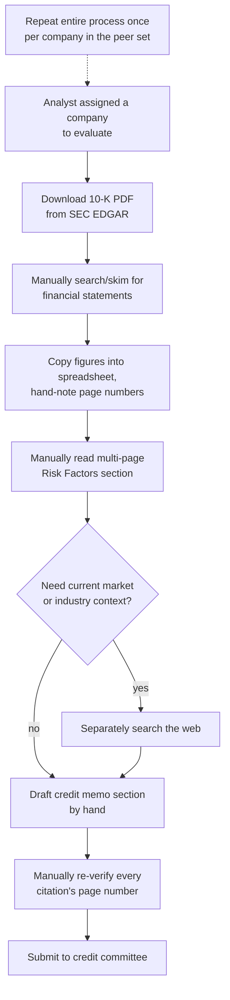
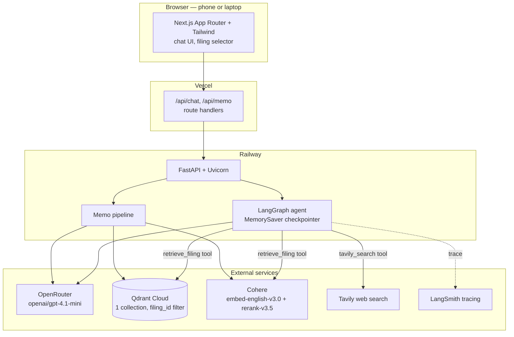

# CreditLens — Certification Challenge Submission

This document addresses each deliverable of the AI Makerspace Certification Challenge v1.0. It complements, rather than replaces, [`README.md`](README.md), which is the technical/developer-facing documentation (setup, architecture reference, repository structure). This document is the narrative write-up: problem, audience, solution, data, evals, and reflection, in the order the rubric asks for them.

- **Live app**: https://credit-lens-teal.vercel.app
- **Backend**: https://credit-lens-production-929c.up.railway.app
- **Repo**: https://github.com/adapaania/credit-lens

---

## Task 1: Problem, Audience, and Scope

### Problem statement

Commercial credit analysts spend hours manually reading hundred-plus-page SEC 10-K filings to find, cross-check, and cite the exact financial figures and risk disclosures a credit memo requires — a process that is slow, error-prone, and hard to audit.

### Who has this problem, and why it's worth solving

The user is a commercial credit analyst: someone at a bank, a corporate lending desk, or an internal risk team who assesses a company's creditworthiness — usually to support a lending decision, a credit line renewal, or an internal risk rating. Their core deliverable is a credit memo: a written assessment that states specific figures (revenue, net income, total debt, cash, liquidity ratios) and specific risks (litigation, regulatory exposure, industry headwinds), each one expected to be traceable back to the exact page of the filing it came from, because credit committees and auditors will ask "where did this number come from?"

Today that traceability is entirely manual. An analyst assigned to evaluate Boeing's credit profile downloads the 10-K PDF from SEC EDGAR (over 150 pages), then works through it largely by `Ctrl-F` and skimming: locating the consolidated income statement, balance sheet, and cash flow statement; copying figures like revenue, net income, total debt, cash, current assets, and current liabilities into a spreadsheet or memo template; and manually noting the page number next to each figure so it can be verified later. To assess a company-specific credit risk — for Boeing, the 737 MAX production and FAA-scrutiny fallout — they read the multi-page "Risk Factors" section by hand and often separately search the web to check whether an older disclosed risk is still current. When comparing a peer set (Boeing vs. Lockheed Martin vs. RTX, as in this project), the entire process repeats once per company, with the analyst cross-referencing spreadsheets side by side. Drafting the memo's "Financial Summary & Risk Factors" section is then manual synthesis: re-reading notes, writing prose, and re-checking each citation's page number by hand before submission. This can take several hours per filing, and every step where a figure is copied by hand is a place a citation can silently drift from its source.

### Current-state workflow (no AI assistance)

### Scope for this build

Three FY2024 10-K filings (Boeing, Lockheed Martin, RTX — an aerospace/defense peer set chosen because Boeing's 737 MAX aftermath gives a clear, demonstrable link between operational/regulatory risk and credit risk), one chat-style Q&A interface with source citations, one memo-drafting feature, and one evaluation harness that proves the app's financial figures actually match the filings rather than trusting the model's word for it.

### Evaluation questions

Rather than an ad hoc list, the actual evaluation set used throughout this build lives at [`data/golden/questions.jsonl`](data/golden/questions.jsonl) — 22 hand-written questions across the three filings: 18 numeric (asking for a specific figure, each backed by a hand-verified truth value in [`data/golden/numeric_truth.jsonl`](data/golden/numeric_truth.jsonl)) and 4 qualitative (asking about disclosed risks). A representative sample:

| Question | Type |
|---|---|
| What was Boeing's total consolidated revenue in fiscal year 2024? | numeric |
| What was Boeing's total debt at the end of fiscal year 2024? | numeric |
| What were RTX's total current assets at the end of fiscal year 2024? | numeric |
| What liquidity risks did Boeing disclose? | qualitative |
| What does Boeing disclose about production disruptions related to the 737 MAX and FAA scrutiny? | qualitative |
| What are Lockheed Martin's main risks related to its reliance on U.S. government contracts? | qualitative |

This same set is what Task 5's evaluation harness runs against.

---

## Task 2: Proposed Solution

### One-sentence solution

CreditLens is an agentic RAG application that lets a credit analyst select a SEC 10-K, ask natural-language questions or request a drafted memo section, and get back answers where every financial figure is grounded in and cited to an exact page and section of the filing — with an agent that can also pull in current market context from the web when a question calls for it, without ever presenting web data as if it were a filing figure.

A credit analyst opens the app, picks a filing from a dropdown, and asks questions the way they'd ask a colleague — "what's Boeing's total debt?", "what liquidity risks did they disclose?", "how does that compare to Lockheed?" — in a normal chat thread that remembers earlier turns. Every financial figure in the response carries a `(page N, section)` citation traceable to the source PDF, and a "Draft memo section" button turns the same retrieval pipeline into a structured, cited Financial Summary & Risk Factors write-up. If a question needs context outside the filing (say, current market conditions), the agent decides on its own to search the web instead of guessing, and keeps that answer clearly separated from anything sourced to the SEC filing.

### Infrastructure diagram

| Component | Choice | Why |
|---|---|---|
| Frontend | Next.js App Router + Tailwind, on Vercel | Responsive out of the box — meets the hard requirement that the app work on both phone and laptop browsers, no separate mobile build |
| Backend | FastAPI + Uvicorn, on Railway | Lightweight Python service; matches the LangGraph/LangChain ecosystem natively rather than bridging from another language |
| LLM gateway | OpenRouter, `openai/gpt-4.1-mini` | Hard requirement — every LLM call goes through one gateway instead of a raw OpenAI SDK call, so the underlying model is swappable without touching app code |
| Agent orchestration | LangGraph `StateGraph` + `MemorySaver` checkpointer | Gives the agent per-thread conversational memory and explicit tool-routing (`tools_condition`) instead of hand-rolling a loop |
| Embeddings | Cohere `embed-english-v3.0` | OpenRouter has no embeddings endpoint, so this is isolated in one swappable module (`ingestion/embeddings.py`) rather than baked into the retrieval code |
| Vector store | Qdrant Cloud, one collection filtered by `filing_id` | Keeps all filings in a single collection instead of provisioning one per filing; requires an explicit payload index on `filing_id` for Qdrant Cloud to allow filtered queries |
| Reranker | Cohere Rerank `rerank-v3.5` | Used in the hybrid retrieval pipeline (Task 6) to cut a fused candidate set down to the most relevant chunks |
| Lexical retrieval | BM25 (`rank_bm25`) | Combined with dense retrieval via reciprocal rank fusion — catches exact-term matches (e.g. an exact line-item label) that embeddings alone can miss |
| External search | Tavily | Gives the agent a second, clearly-bounded data source for context that isn't in the filing, per the hard "two data sources" requirement |
| Observability | LangSmith tracing | Auto-instrumented by LangChain when `LANGCHAIN_TRACING_V2`/`LANGCHAIN_API_KEY`/`LANGCHAIN_PROJECT` are set — no extra code, just env vars |
| Evals | Ragas + a custom numeric exact-match harness | Ragas alone can't verify a specific dollar figure is correct; the custom harness (Task 5) exists specifically to check that |

### Agent workflow diagram

The agent is a two-node LangGraph: an `agent` node that calls the LLM (bound to both tools) and a `tools` node (`ToolNode`) that executes whichever tool the model chose. `tools_condition` routes back to `tools` whenever the model's response is a tool call, and to `END` once it produces a plain-text answer — so the agent can chain multiple tool calls in one turn (e.g. retrieve filing data, then also search the web) before answering. The routing rule enforced in the system prompt, not just convention, is that company-specific financial figures must come from `retrieve_filing`, current market/industry context may come from `tavily_search`, and the two are never blended into a single cited value. The `MemorySaver` checkpointer, keyed by a frontend-generated `thread_id`, means a follow-up question like "how does that compare to Lockheed?" resolves against the actual prior turns in that thread rather than needing to be self-contained.

---

## Task 3: Data

### Chunking strategy

Filings are parsed page-by-page with `pymupdf4llm` (which preserves page numbers — essential, since every figure in the app must cite one) and then chunked in [`backend/app/ingestion/chunk.py`](backend/app/ingestion/chunk.py) by two rules:

1. **Section-aware**: a chunk boundary is drawn wherever a markdown header line appears (`#`-style headers, or a standalone bold line). One specific tuning decision mattered here: bold *and* italic lines (`**_like this_**`) are risk-factor emphasis style in this SEC corpus, not real section headers — treating them as headers was an early bug that mis-attributed 27 chunks across 8 pages to one wrong header. Real structural headers in this corpus are bold-only, so italic+bold lines are now explicitly excluded from header detection.
2. **Table-safe**: a markdown table block is never split mid-table. A 10-K's financial statements are tables where a line-item label and its value live in the same row — splitting a table chunk arbitrarily by character count could separate "Total debt" from "$53,864" onto two different chunks, silently breaking the citation.

Non-table chunks are capped at 1,500 characters to keep embeddings focused; table chunks are kept atomic regardless of size, on the theory that a broken table is worse than an oversized one. (Task 6 below found a secondary consequence of this: a short, terse table row like "Total current assets 127,998" doesn't lexically or semantically stand out against filler words in a full natural-language question, even though the row itself is chunked and indexed correctly — the fix there was on the retrieval side, not chunking.)

### Data sources and how they interact

**1. Curated SEC filing corpus** — three FY2024 10-Ks, sourced directly from SEC EDGAR by accession number (not a third-party mirror or aggregator), verifiable:

| Company | Accession Number | Filed |
|---|---|---|
| Boeing | 0000012927-25-000015 | 2025-02-03 |
| Lockheed Martin | 0000936468-25-000009 | 2025-01-28 |
| RTX | 0000101829-25-000005 | 2025-02-03 |

SEC EDGAR only serves modern 10-Ks as inline-XBRL HTML, not as native PDF, so each `.htm` was converted to a paginated PDF with headless Chrome (`--print-to-pdf`) purely to give `pymupdf4llm` real page boundaries to cite against — the content itself is untouched, only the container format changed. These three PDFs live in `data/filings/` and are ingested via `scripts/ingest.py` into a single Qdrant collection, each chunk payload carrying `filing_id`, `company`, `fiscal_year`, `section`, `page`, and `text`.

**2. Tavily web search API** — the agent's second tool, used for anything outside the filing: current market conditions, industry news, or context that would be stale or entirely absent from a filing dated months earlier.

**How they interact**: the two sources are never merged into one answer without attribution. The agent's system prompt makes filing retrieval mandatory for any company-specific financial figure, and explicitly forbids presenting a Tavily result as if it were a filing-sourced number. If a question genuinely needs both (e.g. "how does Boeing's leverage compare to where interest rates are heading"), the agent calls both tools and attributes each piece of the answer to its actual source, calling out explicitly when the two cover different time periods or could conflict.

---

## Task 4: End-to-End Prototype and Deployment

Built and deployed. The prototype is live at the URLs above: FastAPI backend on Railway, Next.js frontend on Vercel, `FRONTEND_ORIGIN`/`NEXT_PUBLIC_API_URL` cross-wired between them. `scripts/smoke_test.py` checks `/health` and a real `/chat` round-trip against the deployed backend. The full Definition of Done from the build spec (`CLAUDE.md`) is met: filing selection, cited Q&A, thread-memory follow-ups, web-search routing for non-filing questions, a cited memo section, and both eval pipelines produce saved results.

---

## Task 5: Evaluation Harness and Conclusions

### Test dataset

[`data/golden/questions.jsonl`](data/golden/questions.jsonl) (22 questions) paired with [`data/golden/numeric_truth.jsonl`](data/golden/numeric_truth.jsonl) (18 hand-verified figures, each cross-checked against the actual filing text with its own page/section, independent of whatever the app happens to retrieve).

### Harness

Two complementary measurements, run by [`evals/run_evals.py`](evals/run_evals.py) over both pipelines:

- **Custom numeric exact-match** ([`evals/numeric_eval.py`](evals/numeric_eval.py)): extracts every number mentioned in the model's answer, normalizes for unit/scale wording ("million"/"billion"/"thousand"), and checks whether any of them falls within 0.5% relative tolerance of the truth value, comparing magnitudes rather than signed values (a stated "net loss of $11,817 million" should match a truth value of `-11817` without being penalized for not using a literal minus sign). Ragas alone cannot check this — it scores relevance and faithfulness to retrieved context, not whether a specific dollar figure is actually correct.
- **Ragas**: faithfulness, answer relevancy, and context precision, run against the same 22 questions.

### Conclusions — naive dense retrieval baseline

| Metric | Naive dense (top-8) |
|---|---|
| Numeric accuracy | 33.3% (6/18) |
| Faithfulness | 0.777 |
| Answer relevancy | 0.422 |
| Context precision | 0.250 |

Only one in three numeric questions was answered correctly. The low **context precision** (0.250) is the tell: the model isn't hallucinating so much as it's being handed the wrong context to work with. Faithfulness stayed relatively high (0.777) even as accuracy stayed low, because the model is honestly reporting "the excerpts don't contain that figure" when naive retrieval simply didn't surface the right chunk — a faithful non-answer, but still a failure from the analyst's point of view. This pointed squarely at retrieval, not generation, as the place to invest first, which is exactly what Task 6 does.

(Full per-question detail: [`evals/results/naive_results.md`](evals/results/naive_results.md).)

---

## Task 6: Improving the Prototype

### Improvement 1 — Advanced retriever: naive dense → hybrid

**Why this should help this specific use case**: 10-K financial statements are dense with exact, short, repeated labels ("Total debt," "Total current assets") that a lexical/keyword signal like BM25 can match precisely, while dense embeddings alone are better at conceptual similarity than at pinpointing one exact line among many similarly-worded ones — so fusing the two, then reranking with a model trained specifically to judge relevance, should recover the cases naive dense retrieval misses without giving up its strengths on the qualitative, narrative-style questions (e.g. risk factors) where semantic similarity already does well.

Naive dense retrieval (top-8 cosine similarity) was replaced with a hybrid pipeline in [`backend/app/retrieval/hybrid.py`](backend/app/retrieval/hybrid.py): dense (top-20) and BM25 (top-20) candidates are fused with reciprocal rank fusion (k=60), the fused top-20 is reranked with Cohere Rerank (`rerank-v3.5`) down to a final top-6.

| Metric | Naive dense | Hybrid (dense + BM25 + rerank) | Change |
|---|---|---|---|
| Numeric accuracy | 33.3% (6/18) | 66.7% (12/18) | +33.4 pts |
| Faithfulness | 0.777 | 0.708 | −0.069 |
| Answer relevancy | 0.422 | 0.521 | +0.099 |
| Context precision | 0.250 | 0.514 | +0.264 |

Numeric accuracy doubled and context precision more than doubled — hard evidence that a BM25 lexical signal fused with dense embeddings, followed by a rerank pass, surfaces the correct financial-statement chunk far more often than dense similarity alone. Faithfulness dropped slightly, which is the direct trade-off of accuracy going up: naive retrieval's higher faithfulness score was partly an artifact of the model correctly declining to answer when it had no relevant context (a "faithful non-answer"); hybrid retrieval gives it correct context more often, so it attempts — and gets right — more answers it previously would have declined.

(Full per-question detail: [`evals/results/hybrid_results.md`](evals/results/hybrid_results.md).)

### Improvement 2 — Query rewriting before retrieval

Digging into hybrid's remaining 6 failures (out of 18) found something worth fixing on its own: **every one of the 6 failures was a `current_assets` or `current_liabilities` question, for all three companies, in both the naive and hybrid pipelines** — a 100%-consistent pattern, not scattered noise.

Diagnosis: the correct chunk (e.g. Boeing's balance sheet row "**Total current assets** **127,998**") is indexed and retrievable — but a raw natural-language question like *"What were Boeing's total current assets at the end of fiscal year 2024?"* is mostly filler words ("what were", "at the end of", "fiscal year 2024") that appear in nearly every chunk of a 10-K, diluting both BM25's term-weighting and the dense embedding's similarity signal enough that the correct chunk never reaches the top 20 candidates for either retriever. Confirmed directly: passing the short query `"total current assets"` instead of the full question retrieves that exact chunk at rank 0 every time. `backend/app/memo.py`'s figure-extraction step had already independently sidestepped this exact problem by hand-writing short targeted queries per figure (`FIGURE_QUERIES = {"current_assets": "total current assets", ...}`) — which is why the memo feature never had this bug, even though the chat/eval path did.

The fix, [`backend/app/retrieval/query_rewrite.py`](backend/app/retrieval/query_rewrite.py), generalizes that same idea to arbitrary questions instead of six hardcoded ones: a small LLM call rewrites the user's question into a short, targeted keyword query before it reaches the retriever, falling back to the original question on any error. This was applied in two places — not just the eval harness:

- **Production**: `backend/app/agent/tools.py`'s `retrieve_filing` tool now rewrites the agent's query before calling retrieval, so the deployed chat app benefits, not just the eval script.
- **Eval harness**: `evals/run_evals.py --rewrite` wraps whichever retriever is under test with the same rewrite step, so it can be measured in isolation on top of hybrid.

While diagnosing this, a second, separate gap surfaced: **the deployed `/chat` and `/memo` endpoints were still importing naive dense retrieval**, not hybrid — Phase 4 built and evaluated hybrid retrieval but never actually promoted it into the production code path. That's fixed as part of this pass too (`tools.py` and `memo.py` now both import from `retrieval/hybrid.py`), so the numbers below reflect what's now actually deployed, not just what was measured in isolation.

| Metric | Hybrid | Hybrid + query rewrite | Change |
|---|---|---|---|
| Numeric accuracy | 66.7% (12/18) | **83.3% (15/18)** | **+16.6 pts** |
| Faithfulness | 0.708 | 0.576 | −0.132 |
| Answer relevancy | 0.521 | 0.731 | +0.210 |
| Context precision | 0.514 | 0.628 | +0.114 |

Five of the six previously-failing questions flipped to correct: Boeing's and Lockheed's `current_assets`/`current_liabilities` questions all now pass, and RTX's total-debt answer changed from a borderline-correct-by-tolerance-only figure (see Phase 4's known-limitation note: it had picked "total principal long-term debt" from a debt-maturity note, not the actual "Total debt" line, and only passed the numeric check by coincidence of similar magnitude) to the *actual* "Total debt" figure from the Liquidity and Financial Condition section — an exact match to the golden truth, not a lucky one.

This did not come for free, and it's worth reporting the trade-off honestly rather than only the headline number:

- **`lockheed_cash_2024` regressed** from correct to incorrect. The original hybrid run's retrieved context happened to include a chunk stating the exact figure ("$2,483 million"), while the rewritten query's top-6 only surfaced a chunk with the rounded "$2.5 billion" — which computes to $2,500M, a 0.68% relative error, just outside the harness's 0.5% tolerance. This is a query-rewrite-changed-which-chunks-won-the-rerank case, not a hallucination.
- **`rtx_current_liabilities_2024` changed from an honest non-answer to a confidently wrong one** — it now cites "$13,595 million (page 173, NOTE 15: VARIABLE INTEREST ENTITIES)," an unrelated total from a different footnote table, rather than the actual balance sheet figure. A 10-K has many tables with a "Total X" row across different footnotes; a short keyword query is more prone to matching the wrong one of several similarly-labeled totals than a longer, more specific question would be. This is arguably a worse failure mode than the "not disclosed" answer it replaced, since it's wrong but reads as confident and cited.
- **`rtx_current_assets_2024` remained an honest non-answer** — the fix didn't reach it either way for RTX specifically.

So the aggregate faithfulness drop (0.708 → 0.576) is not just a side effect of attempting more answers (as it was going from naive to hybrid) — part of it is this real, specific new failure mode. The net effect across the golden set is clearly positive (+16.6 points of numeric accuracy, and answer relevancy and context precision both improved too), but a production rollout of query rewriting should pair it with the label-matching verification step called out in Task 7, not treat it as a strict improvement with no downside.

(Full per-question detail: [`evals/results/hybrid-rewrite_results.md`](evals/results/hybrid-rewrite_results.md).)

### Three-way comparison

| Metric | Naive dense | Hybrid | Hybrid + query rewrite |
|---|---|---|---|
| Numeric accuracy | 33.3% | 66.7% | **83.3%** |
| Faithfulness | 0.777 | 0.708 | 0.576 |
| Answer relevancy | 0.422 | 0.521 | 0.731 |
| Context precision | 0.250 | 0.514 | 0.628 |

---

## Task 7: Next Steps — What to Keep, What to Change for Demo Day

**Keep:**
- Hybrid retrieval + query rewriting as the default retrieval path — the eval harness makes the case for both concretely rather than by assertion.
- The citation-strict prompting and the hard source-boundary rule between filing data and web data — this is the trust mechanism the whole product depends on, and it held up under adversarial-style questions during testing (asking for figures not in the filing correctly produced "not disclosed" rather than an invented number).
- The eval harness itself as a standing regression gate — any future prompt or retrieval change should be run through it before shipping, the same way the query-rewrite change was validated here rather than assumed to help.

**Change or investigate next:**
- **Eval set size and scope.** 22 questions across one fiscal year is enough to catch the retrieval bug this write-up documents, but too small to trust a percentage-point-level comparison between close pipeline variants. A larger, more adversarial question set (ambiguous phrasing, multi-year trend questions, deliberately-similar-labeled line items) would give more statistically meaningful deltas.
- **Citation *page* precision, not just numeric correctness.** The current harness checks whether the right *value* appears in the answer, not whether the *specific cited page* is the exact right one when a figure legitimately appears on more than one page (e.g. once in the balance sheet, once in a footnote). This was flagged as a known limitation earlier in the build and is still open.
- **Wrong-similarly-labeled-total risk.** Query rewriting happened to fix RTX's total-debt line-item ambiguity (Phase 3/4's known limitation — the model previously picked "total principal long-term debt" from a debt-maturity note rather than the real "Total debt" line, passing only by tolerance coincidence), but it introduced the same failure mode elsewhere: `rtx_current_liabilities_2024` now confidently cites an unrelated "Total X" row from a different footnote table. A 10-K has many tables with similarly-labeled totals, and a short keyword query is more prone to matching the wrong one than a longer, specific question. Neither the numeric-tolerance check nor Ragas faithfulness reliably catches "right magnitude, wrong line item" — an explicit label-matching verification step (does the cited row's exact text label match the concept the question asked about?) would.
- **Persistent memory.** `MemorySaver` is in-memory and keyed per-process — fine for a single-instance deployment, but a Railway redeploy or restart drops all thread history. A Postgres-backed LangGraph checkpointer would make memory survive deploys.
- **More filings and multi-year data.** Real credit analysis is trend-driven (is leverage rising or falling year over year?), and this build only ingests a single fiscal year per company.
- **Latency of the query-rewrite step.** It adds one more LLM round-trip before every retrieval call. A smaller/faster model for that specific step (or caching rewrites for repeated question patterns) would be worth measuring against the accuracy gain it provides.

---

## Loom Video and Written Document

Per the submission requirements: this document is the written deliverable covering every task above. The ≤10-minute Loom demo video is tracked separately and is not part of this repository's code.
